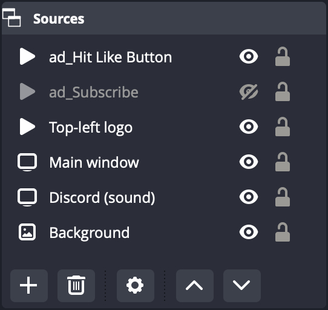

# OBS script for rotating ads media

This is a script for [Open Broadcaster Software](https://obsproject.com/) (OBS), that perform interval based rotation of media. Those media may be for example advertisements, or they can be call-to-actions (subscribe to my channel, give it a like banners etc.)

If only one ad media is present, then the script restarts the play of the media on the specified interval. If there are multiple ad media present, then the media rotate, only one will be displayed at a time, changing on the interval.

## Pre-requisites

You need the following:

* OBS installed
* Python 3 installed
* Python 3 path configured in OBS (menu Tools → Scripts, tab Python Settings)

I have successfully tested the script with OBS 29.0.2 and Python 3.10.10 on macOS 13.2.1. I believe it will work with any OBS 21+, any Python 3.6+ and any modern Windows / Linux / macOS version, but I have not tested that.

## Setup

Name your ad media (sources) so they start with ad_ 
The script will operate on media named this way; it will not touch other sources.

If there is only one ad media, then it needs to be visible. The script will not change its visibility, it will only restart the play on the specified interval.

If there are multiple ad media, the script toggles their visibility to perform the cycle. The media can be in any visibility state (visible or hidden), after the first full cycle there will be only one visible media at a time.

Open Tools → Scripts and load the script. Adjust the interval to your liking, default is 5 minutes (300 seconds). Press the Start to run the cycle.

The Scripts window can be closed and the cycle will continue.

You can add / remove ad media, re-arange their order or change the interval in the mid of script running, it will adapt. You don't need to stop the script for such changes.

You just need to start the script after you start OBS. It will not start automatically (this is intentional).

## Known issues

Due to a bug in OBS, I could not implement stopping the script properly. If you press the Stop button, the flow only stops on its next execution (when the rotation triggers next time, it stops the timer instead of running next cycle).

Due to that, Start button should not be pressed again until the cycle is finished.

## Licence

WTFPL License 2.0 applies

<code>           DO WHAT THE FUCK YOU WANT TO PUBLIC LICENSE
                   Version 2, December 2004

Copyright (C) 2004 Sam Hocevar <sam@hocevar.net>

Everyone is permitted to copy and distribute verbatim or modified
copies of this license document, and changing it is allowed as long
as the name is changed.

           DO WHAT THE FUCK YOU WANT TO PUBLIC LICENSE
  TERMS AND CONDITIONS FOR COPYING, DISTRIBUTION AND MODIFICATION

 0. You just DO WHAT THE FUCK YOU WANT TO.</code>
